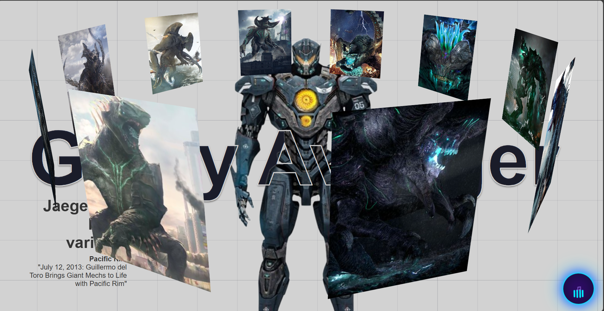

# 3D-Image-Slider


---

## 🚀 Live Demo
🌐 [View it on GitHub Pages](https://abhaydutta.github.io/3D-Image-Slider/)

> 🎯 A CSS-only 3D image slider inspired by Pacific Rim's Kaijus & Jaegers, with a built-in music player and fully responsive UI.

---

## 📸 Project Preview


---

## 📂 Features
-  Pure HTML & CSS — no JavaScript needed
-  3D rotating image carousel
-  Music player box integrated into the UI
-  Fully responsive for mobile & desktop
-  Easy to customize images, background & music

---

## 🚀 Getting Started
1. Clone the repository:
    ```bash
    git clone https://github.com/AbhayDutta/3D-Image-Slider.git
    ```
2. Open `index.html` in your browser.

---

## 📝 License
MIT — free to use & modify.  
Give a ⭐ if you like it!

---
